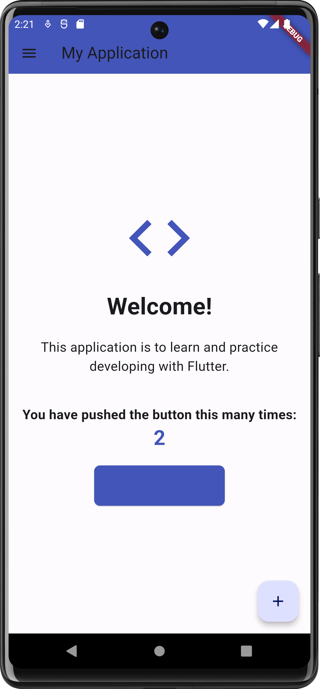
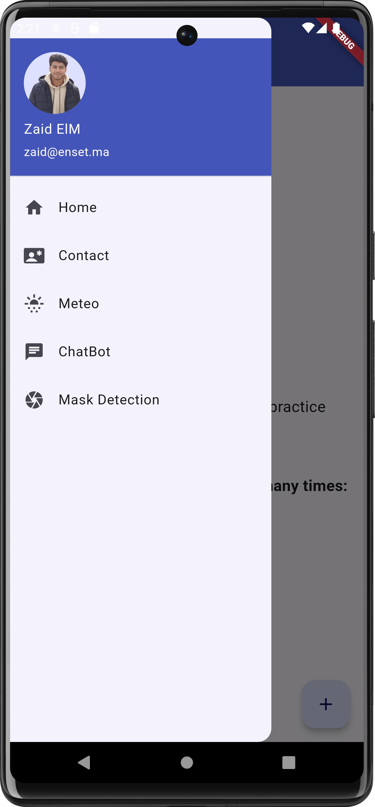
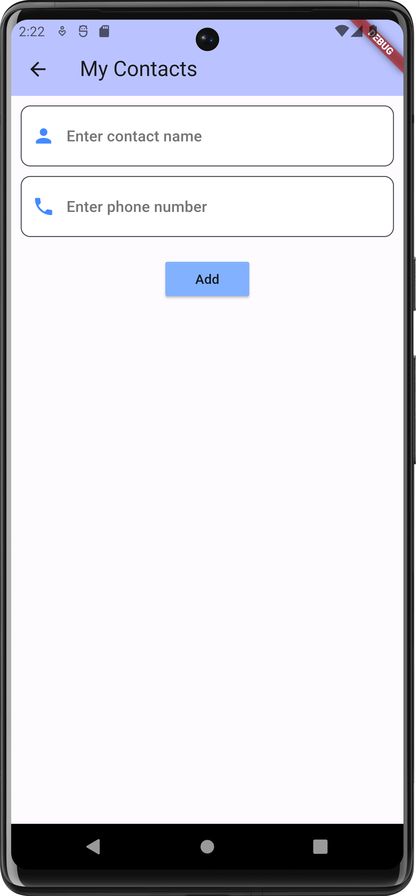
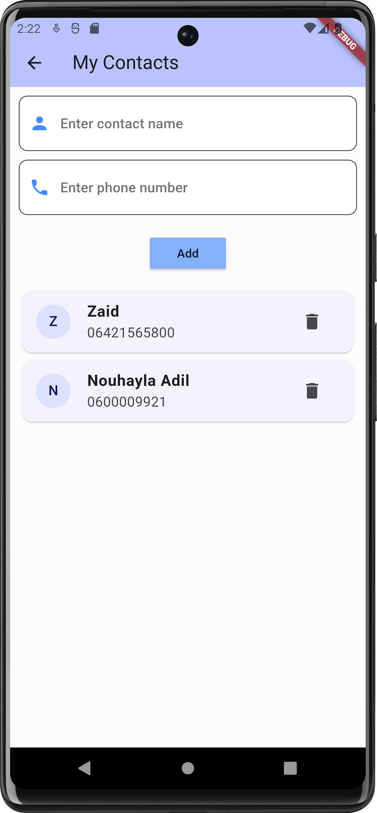
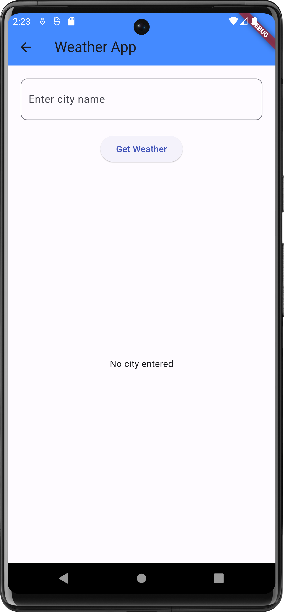
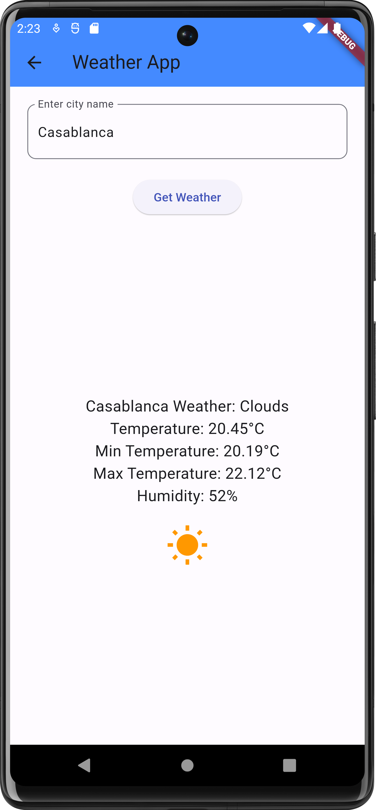
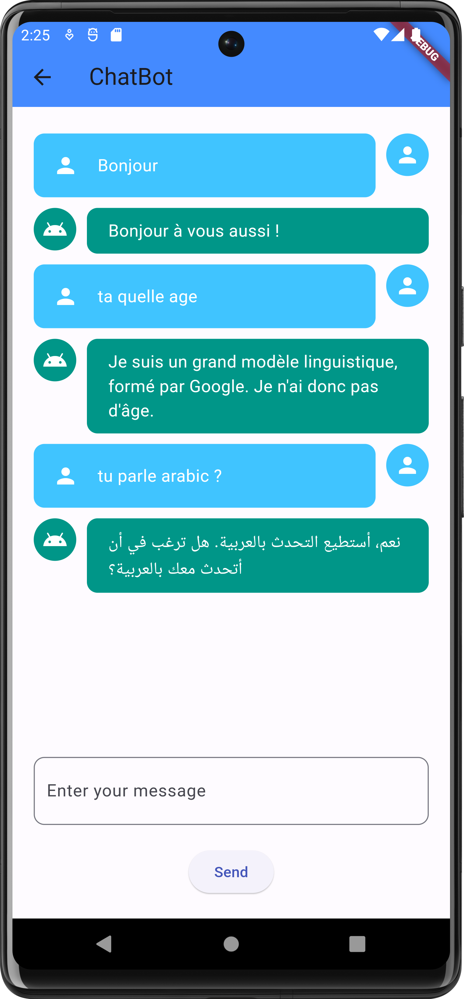
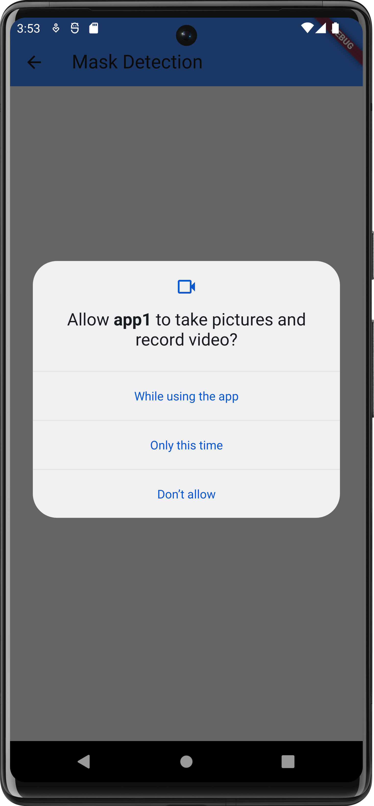
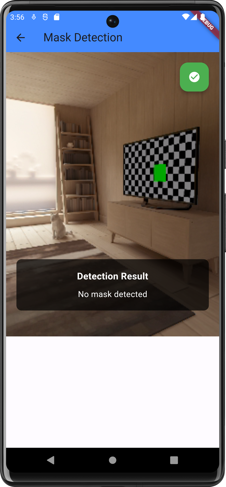

# Flutter Multi-Feature Application


This project is a multi-feature application developed using Flutter. It includes functionalities such as adding and deleting contacts, weather information retrieval, chatbot interaction, and mask detection using the phone's camera.

## 📋 Table of Contents

- [📖 Introduction](#introduction)
- [✨ Features](#features)
    - [🏠 Home](#home)
    - [📇 Contact](#contact)
    - [🌦️ Weather](#weather)
    - [🤖 ChatBot](#chatbot)
    - [😷 Mask Detection](#mask-detection)
- [⚙️ Installation](#installation)
- [🚀 Usage](#usage)
- [📂 Project Structure](#project-structure)
- [🤝 Contributing](#contributing)

## 📖 Introduction

This project demonstrates the use of Flutter to create a mobile application with multiple functionalities. The goal is to provide a practical learning experience in Flutter development.

## ✨ Features

### 🏠 Home

The Home page serves as the main interface where users can navigate to different sections of the app.




### 📇 Contact

The Contact page allows users to add and delete contact information.




### 🌦️ Weather

The Weather page fetches real-time weather information based on the city entered by the user using the OpenWeatherMap API.




### 🤖 ChatBot

The ChatBot page integrates with Google Generative AI to provide interactive conversations.



### 😷 Mask Detection

The Mask Detection page uses the phone's camera to detect whether the user is wearing a mask.




## ⚙️ Installation

To run this project, follow these steps:

1. **Clone the repository:**
   ```bash
   git clone https://github.com/ELMOUADDIBE/flutter-demo-app.git
   cd flutter-app
   ```

2. **Install dependencies:**
   ```bash
   flutter pub get
   ```

3. **Run the app:**
   ```bash
   flutter run
   ```

## Usage

1. **Navigate to different sections:**
   Use the drawer to navigate between Home, Contact, Weather, ChatBot, and Mask Detection pages.

2. **Add and Delete Contacts:**
   Go to the Contact page to add or delete contact information.

3. **Check Weather:**
   Enter a city name on the Weather page to get real-time weather updates.

4. **Interact with the ChatBot:**
   Use the ChatBot page to have interactive conversations with the AI.

5. **Mask Detection:**
   Open the Mask Detection page and allow camera access to detect masks.

## Project Structure

```
flutter-app/
├── android/
├── assets/
│   └── model.tflite
├── ios/
├── lib/
│   ├── main.dart
│   ├── contact_page.dart
│   ├── weather_page.dart
│   ├── chatbot_page.dart
│   ├── mask_detection_page.dart
├── screenshots/
│   ├── home.png
│   ├── contact.png
│   ├── weather.png
│   ├── chatbot.png
│   └── mask_detection.png
├── pubspec.yaml
└── README.md
```

## Contributing

> Contributions are welcome! Please feel free to submit a Pull Request.\
> **This is an open-source demo project in Flutter.**